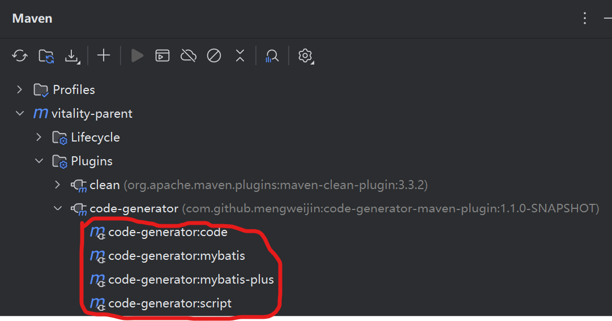

# code-generator-maven-plugin

Language: [中文](README.zh.md)

	
	
	
	
	
	

## Description
The code-generator-maven-plugin is an MVC project that generates Controller, Service, Entity, Dao(Mybatis: Mapper; JPA: Repository) layer of CRUD code maven plugin.
Implementation is based on Baomidou's mybatis-plus-generator.

Supported frameworks：Mybatis, Mybatis-Plus, JPA。

Theory can be extended to any background and front database table related technology: such as: vue.js.

The theory supports all databases that support JDBC connection: for example: DB2, DM, H2, Mariadb, MySQL, Oracle, Postgre, Sqlite, SQLServer, etc.

## how to use?
### 1. Introduction to Use
In the standard SpringBoot project, take Intellij IDEA, a development tool, as an example: the code-generator-maven-plugin was introduced into Maven
~~~~xml
<plugin>
    <groupId>com.github.mengweijin</groupId>
    <artifactId>code-generator-maven-plugin</artifactId>
    <version>Latest Version</version>
</plugin>
~~~~
Locate the code-generator-maven-plugin in the Intellij IDEA Maven module shown below and double-click the corresponding plug-in command.

#### Notes
* The default code generation is under the target/code-generator/ directory of the current project.
* The default package path is com.github.mengweijin.

### 2. General Use
~~~~xml
<plugin>
    <groupId>com.github.mengweijin</groupId>
    <artifactId>code-generator-maven-plugin</artifactId>
    <version>Latest Version</version>
    <configuration>
        <parameters>
            <tables>sys_user</tables>
            <tablePrefix>sys_</tablePrefix>
            <superEntityClass>com.github.mengweijin.quickboot.mybatis.BaseEntity</superEntityClass>
            <lombokModel>false</lombokModel>
            <dbInfo>
                <username>root</username>
                <password>root</password>
                <driverName>com.mysql.cj.jdbc.Driver</driverName>
                <url>jdbc:mysql://192.168.83.128:3306/mwj_cms</url>
            </dbInfo>
        </parameters>
    </configuration>
</plugin>
~~~~
### 3. Full Configuration to Use
~~~~xml
<plugin>
    <groupId>com.github.mengweijin</groupId>
    <artifactId>code-generator-maven-plugin</artifactId>
    <version>Latest Version</version>
    <configuration>
        <parameters>
            <!--The package path that the code generates.               Default：com.github.mengweijin-->
            <outputPackage>com.github.mengweijin</outputPackage>
            <!--The value of @author above the class comment.           Default：Gets the user name of the current computer.-->
            <author>mengweijin</author>
            <!--(No configuration is required for the current version.)
                Customize the template file that generates the code, generally without configuration. 
                For configuration, you need to configure the directory of the absolute path.-->
            <!--<templateLocation>C:\\templates\</templateLocation>-->
            <!--(No configuration is required for the current version.)Customize the type of template engine that generates the code, generally without configuration. 
                For configuration, 'beetl', 'velocity' and 'freemarker' are supported-->
            <!--<templateType>C:\\templates\</templateType>-->
            <!--Database connection information. 
            If it is a standard SpringBoot engineering, can be omitted, it will automatically read application.Yml/yaml/properties file.-->
            <dbInfo>
                <username>root</username>
                <password>root</password>
                <driverName>com.mysql.cj.jdbc.Driver</driverName>
                <url>jdbc:mysql://192.168.83.128:3306/mwj_cms</url>
            </dbInfo>
            <!--The database table name to generate the code for. If not configured, all the tables in the database will be generated.
                Some databases are case-sensitive to table names, and the table names that need to be configured are exactly the same as those in the database.
                Multiple table names are separated by English commas.-->
            <tables>sys_user, rlt_user_role</tables>
            <!--To generate a prefix for the database table name corresponding to the code. 
                Once configured, the generated Entity class is not prefixed with a table. Such as：User, UserRole.
                If not configured, the generated Entity class is prefixed with a table. Such as：SysUser, RltUserRole.
                Multiple table name prefixes are separated by English commas.-->
            <tablePrefix>sys_, rlt_</tablePrefix>
            <!--The parent class inherited by the generated Entity class.-->
            <superEntityClass>com.github.mengweijin.BaseEntity</superEntityClass>
            <!--The generated Entity class inherits a common field in the BaseEntity parent class.
                If not configured, the program takes its properties based on the configured superEntityClass, 
                then the camel case name is converted to an underscore as the common column name for the database table.
                If configured, whichever is configured.
                Therefore, if your database table field naming rules and BaseEntity naming rules are also humped to underscore, you may not configure this item.
            -->
            <superEntityColumns>create_time, update_time, create_by, update_by</superEntityColumns>
            <!--The generated Controller class inherits from the parent class.-->
            <superControllerClass>com.github.mengweijin.BaseController</superControllerClass>
            <!--(No configuration is required for the current version.) The parent class that the generated Dao class inherits.-->
            <!--<superDaoClass>com.github.mengweijin.BaseMapper</superDaoClass>-->
            <!--(No configuration is required for the current version.) The parent class that the generated Service class inherits.-->
            <!--<superServiceClass>com.github.mengweijin.BaseService</superServiceClass>-->
            <!--(No configuration is required for the current version.) The parent class that the generated ServiceImpl class inherits.-->
            <!--<superServiceImplClass>com.github.mengweijin.BaseServiceImpl</superServiceImplClass>-->
            <!--Whether the generated Entity is lombok mode enabled.
                Not configured or configured to true: Lombok enabled;
                Configured as false: Without Lombok mode enabled, the generated Entity contains getter/setter/toString methods.
            -->
            <lombokModel>false</lombokModel>

        </parameters>
    </configuration>
</plugin>
~~~~
## FAQ
1. Throw an exception like this: java.lang.ClassNotFoundException: org.h2.Driver，Unable to find driver class.
  * When configuring driver classes, you cannot configure Maven's Scope node to have a value of runtime.
    ~~~~
    <dependency>
        <groupId>com.h2database</groupId>
        <artifactId>h2</artifactId>
        <!--Comment out this line. Same goes for any other database driver. <scope>runtime</scope> -->
    </dependency>
    ~~~~
2. The database table exists, but no code file is generated, and the program does not report an error.
  * Configure database table names to be exactly the same as table names in the database.
  For example, when an H2 database creates a table with a script, the script name is written in lowercase,
  but the generated table name may be in upper case, so you need to configure the upper case table name here.

## Futures
You are welcome to suggest better ways to improve this widget.
## Contributions
You are welcome to contribute code, let more people more time to accompany the people you care about.
